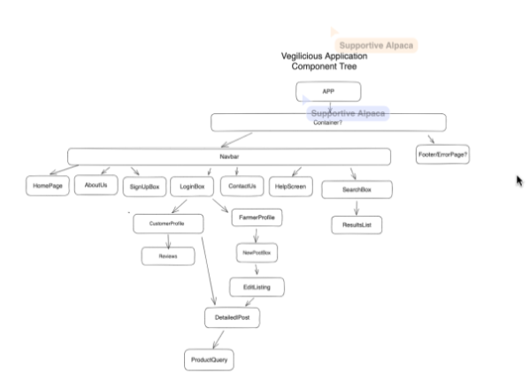

# Vegilicious
An app for farmers to post pictures and descriptions of their produce and for users to notifiy farmers of their intention to buy these.
Users can then arrange to buy and collect produce and leave reviews on the produce they have bought.  Reviews and produce can be seen by all users.

## Goal
Technology has meant that people can now access food online in a variety of apps.  There is also a need for small local producers to have a space where they can showcase the produce they have so that people can purchase it.  We worked hard to come up with a project idea during our first sprint and finally we decided on teh idea of this app.

### Component tree
The component tree was put together using ideas and comments from all team members and is shown below.

## Tech
In the tech section, we provide information about the technology stack, dependencies, and any technical details related to the project.

### Tech Stack

To develop the Vegelicious app we made use of the following stack of technologies:

- Front-End
 - [HTML3](https://www.w3schools.com/html/)
 - [CSS5](https://www.w3schools.com/css/default.asp)
 - [react](https://www.w3schools.com/react/default.asp)
 - [typescript](https://www.w3schools.com/typescript/typescript_intro.php)

- Back-End
 - [nodejs](https://www.w3schools.com/nodejs/nodejs_intro.asp)

### The Database Design
- The database was designed to allow CRUD functionality to be available to registered users, when signed in.
- We used mongodb for our nosql database.  Items in the database were:
"const {
    name,
    price,
    img,
    unit,
    expired_date,
    description,
    stock,
    farmer,
  }"

- The database was set up with full CRUD functionality.
Path   |   Method	|  Data Requested (json)   |  Function
---| ---| ---| ---|  
/signup   |	post |   {email:string, password:string}	|  register an account
/login   |	post  |		{email:string, password:string}	| log in
/logout	 | get	|  |		log out
/profile  |	put	 |	any data changed |	edit profile
/delete  |	delete	|	None |	delete account

/product |	get	| |	depends on how to display products in the main page	
/product |	put	|   |	all the data required for editing a product	
/product | 	delete	|   |	data id 	
/product/name   |	get	  |  	{name:string}  |	search products by nameS

 

### Dependencies including deployment
- The app was deployed to [vercel](https://vercel.com/) 

### Testing
- testing was done at the start for the project using [jest](https://jestjs.io/)

### Future improvements

### Media

## Credits
We would like to give credit to the following individuals, organizations, and resources that have contributed to the project or provided inspiration:

## guide from Chingu - to be removed later

Your project's `readme` is as important to success as your code. For 
this reason you should put as much care into its creation and maintenance
as you would any other component of the application.

If you are unsure of what should go into the `readme` let this article,
written by an experienced Chingu, be your starting point - 
[Keys to a well written README](https://tinyurl.com/yk3wubft).

And before we go there's "one more thing"! Once you decide what to include
in your `readme` feel free to replace the text we've provided here.

> Own it & Make it your Own!

## Team Documents

You may find these helpful as you work together to organize your project.

- [Team Project Ideas](./docs/team_project_ideas.md)
- [Team Decision Log](./docs/team_decision_log.md)

Meeting Agenda templates (located in the `/docs` directory in this repo):

- Meeting - Voyage Kickoff --> ./docs/meeting-voyage_kickoff.docx
- Meeting - App Vision & Feature Planning --> ./docs/meeting-vision_and_feature_planning.docx
- Meeting - Sprint Retrospective, Review, and Planning --> ./docs/meeting-sprint_retrospective_review_and_planning.docx
- Meeting - Sprint Open Topic Session --> ./docs/meeting-sprint_open_topic_session.docx
