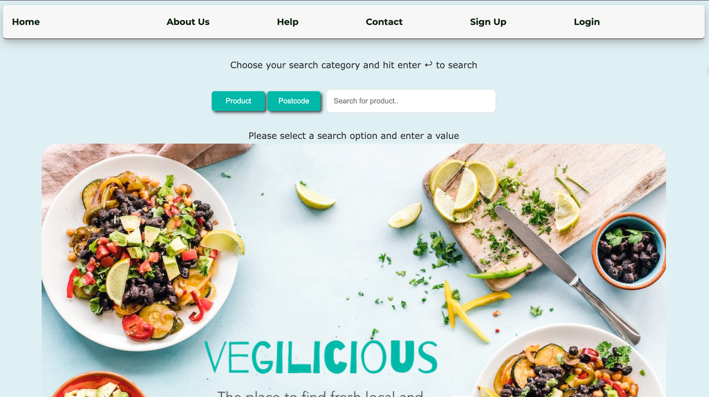
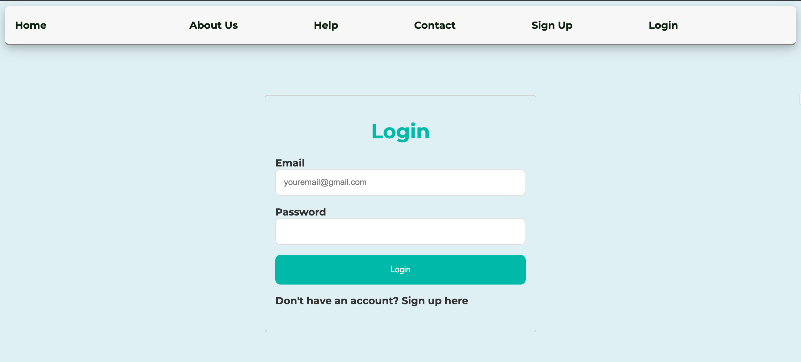
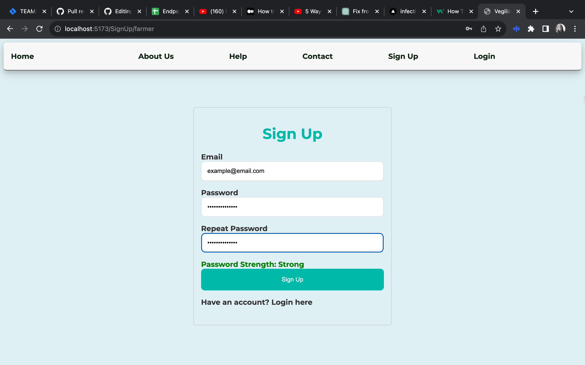
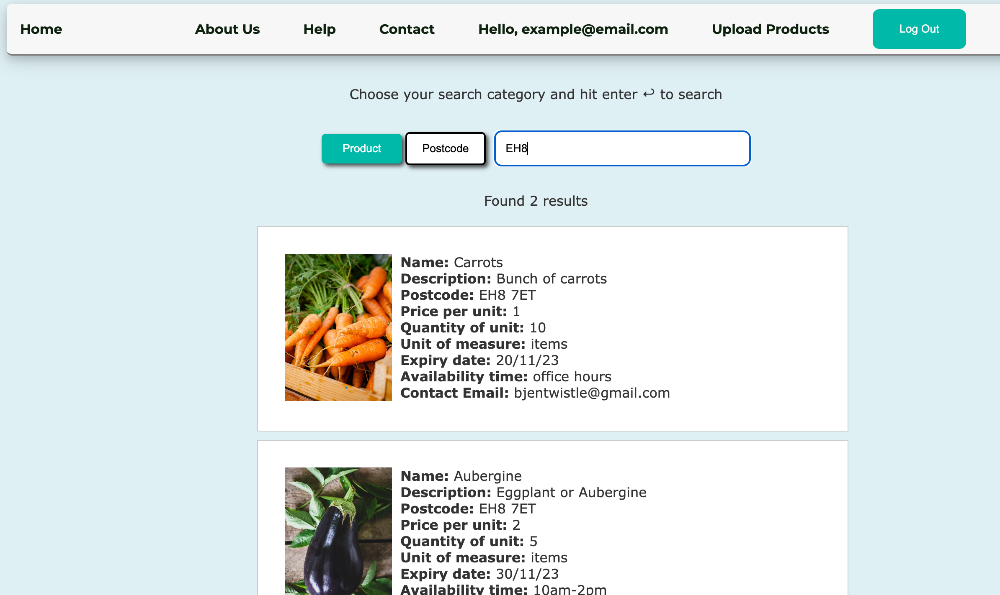

# Vegilicious



An app for farmers to post pictures and descriptions of their produce and for users to contact farmers of their intention to buy products.

## Goal and Key Features

Technology has meant that people can now access food online in a variety of apps. There is also a need for small local producers to have a space where they can showcase the produce they have so that people can purchase it. Farmers and clients are both required to registered an account and login for verification.
We worked hard to come up with a project idea during our first sprint and finally we decided on the idea of this app.

### User Interface

The user interface changed a bit from our original wireframes.






### Collaborations

The app was designed and worked on by 7 team members. Tasks were divided into front end and back end. Valeria was the product owner and held meetings at least 3 times a week as well as doing some backend coding. Three members of the team, Valeria, Justin and Robi were engaged in working the backend with Robi working on deployment. Four members of the team Jena, Shanis, Debbie and Becky worked on frontend tasks. Valeria created a Jira board where we could all enter and assign tasks to work on. People chose to work on whatever tasks they felt most comfortable with and they were also able to work on learning new technologies to extend their skills if they chose. Debbie needed to learn react and typescript as these were new to her having previously coded in Python using Flask and Django. Becky set up an agile stand up sheet in google docs where people could add accomplishments on a daily basis; this helped with sprint planning. Our main meeting was on Friday afternoon where we talked about what had been accomplished in each sprint and planned for the next one, using the agile methodology to plan and manage our work.

## Installation and Setup Locally

To start the project locally type, please install the following software:

### Prerequisites

- npm

  ```sh
  npm install npm@latest -g
  ```

- MongoDB

### Installation

1. Clone the repo

```sh
git clone https://github.com/chingu-voyages/v46-tier3-team-33
```

2. Install NPM packages

Please install npm packages both in the frontend and backend folder seperately.

`cd frontend`
`npm install`
`cd ../backend`
`npm install`

3. Create .env both in the frontend and backend folder

4. Set up the following .env variable in the backend folder:

backend:
BACK_HOST=localhost
BACK_PORT=8081
MONGODB_URL = "mongodb://0.0.0.0/vegilicious"
JWT_SECRET= ""
NODE_ENV= "development"
FRONTEND_HOST="http://localhost:5173"

You may amend these variable basing on your setting.

5. You are ready to run the project locally.

### Running the project locally

To start:

1. In the frontend directory, please type:

`npm run dev`

2. In the backend directory, please type:

`npm start`

3. Open the browser and go to the local host:

`http://localhost:5173/`

To stop:

You can use 'ctrl+c' in the terminal.

## Tech Stack

To develop the Vegilicious app we made use of the following stack of technologies:

- **Frontend**:

  - [HTML5](https://developer.mozilla.org/en-US/docs/Web/Guide/HTML/HTML5)
  - [CSS3](https://developer.mozilla.org/en-US/docs/Web/CSS)
  - [React](https://reactjs.org/)
  - [TypeScript](https://www.typescriptlang.org/)

- **Backend**:

  - [Node.js](https://nodejs.org/)
  - [Express.js](https://expressjs.com/)
  - [TypeScript](https://www.typescriptlang.org/)

- **Database**:
  - [MongoDB](https://www.mongodb.com/)

## Frontend and Backend Design

### Frontend

- Includes pages for:
  - Home
  - About
  - Contact
  - Help
  - Login/Signup
  - Logout
  - Search
  - Results

### Backend

- Implements RESTful API principles for efficient data handling.
- Includes CRUD (Create, Read, Update, Delete) operations.

## Deployment

- Hosted on [Vercel](https://vercel.com/).

## Future Enhancements

- **Email Notifications**: Notify users about new products based on their interests.
- **User Reviews**: Allow users to post reviews of purchased products.
- **Product Categorization**: Enable streamlined search by categorizing products.
- **Community Forum**: Facilitate interactions between users and farmers.

## Credits

#### We would like to give credit to the following individuals, organizations, and resources that have contributed to the project or provided inspiration:

- we used Unsplash for many of the photos on the app. In particular:
- Root vegetable picture
  Photo by Nathan Dumlao on Unsplash

- Question mark picture
  Photo by Simone Secci on Unsplash

- A very big thank you to [Chingu](https://www.chingu.io/) for all the help and support, documentation and very useful articles during this project.
